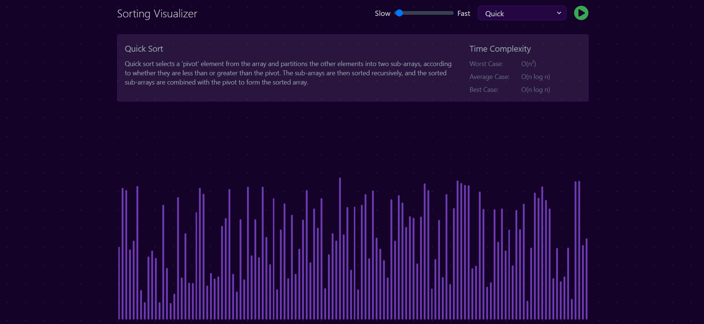

# Sorting Visualizer

This project helps to visualize different sorting algorithms, including Bubble Sort, Selection Sort, Quick Sort, Insertion Sort, and Merge Sort. It provides an interactive way to understand how each algorithm works by animating the sorting process in real time.

